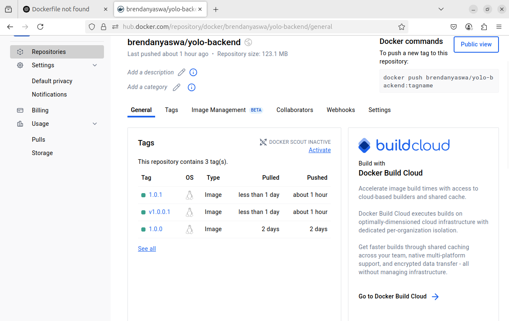
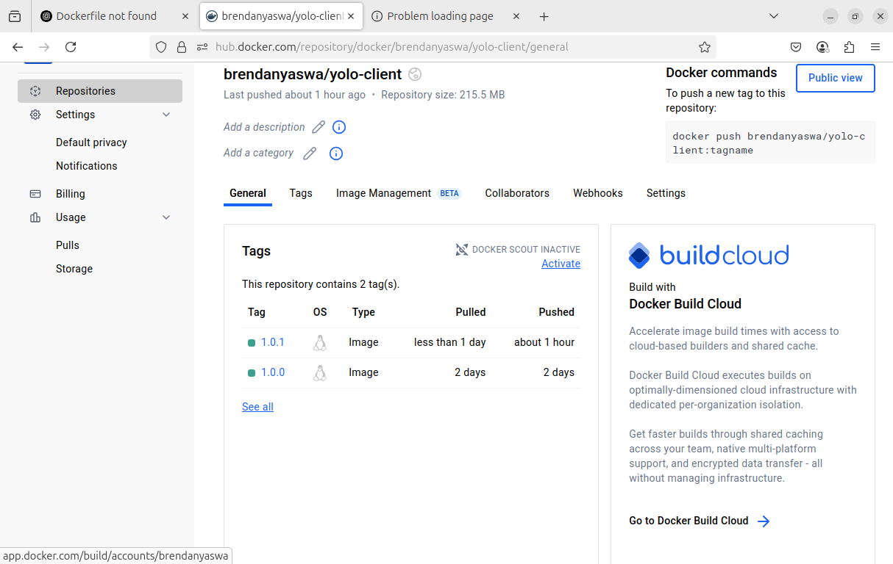

# choice of base image used 
Backend: The base image used is node:14, a lightweight and stable official Node.js image, well-suited for running Node.js applications in containers. It ensures compatibility with most libraries and avoids bloat.

Client: Also uses node:14-slim because the React frontend relies on Node for running scripts like react-scripts start. It simplifies development and build consistency between both services.
The -slim tag reduces image size significantly by excluding unnecessary packages, which improves build time and runtime performance.

# Dockerfile Directives Used

FROM: Specifies the base image (node:14).

WORKDIR: Sets the working directory in the container (/usr/src/app).

COPY: Transfers package*.json for optimized layer caching before installing dependencies, then copies the rest of the app.

RUN npm install: Installs project dependencies.

EXPOSE: Indicates the container’s runtime port.

ENV HOST=0.0.0.0: Ensures the React app binds to the correct interface inside the container.

# Docker-Compose Networking

Each service (backend, client) is defined under docker-compose.yaml.

Port Allocation:

Client: "3000:3000" → local access via http://localhost:3000

Backend: "5001:5000" → local access via http://localhost:5000 -am binding 5001 to 5000 because some process was using port 5000 on my local machine.

Bridge Network: Docker Compose automatically creates a bridge network (yolo_yolo-net) allowing containers to talk to each other by service name (e.g., the client can call http://backend:5000).

# Volume Definition

have added the mongo db volume to persist the data .

#  Git Workflow Used

The workflow followed was:

Initialize Git repository.

Regular commits with descriptive messages.

Final push to GitHub with  Dockerfiles,  docker-compose.yaml included.

# Successful Running & Debugging Measures

Both containers successfully started using docker compose up --build.

Issues debugged:

Port not reachable

Authentication failure while pushing to DockerHub: Resolved by generating a personal access token and using it in docker login.

#  Good Docker Practices

Image Tags: Used version tags such as brendanyaswa/yolo-client:1.0.1 and brendanyaswa/yolo-backend:1.0.1 instead of latest for clarity and reproducibility.

Layer Caching: Installed dependencies before copying the full app to benefit from Docker layer caching.

Multi-stage builds (optional for production) can be added later to reduce image size.

# Screenshot of DockerHub

# Playbook.yml
The `playbook.yml` includes three roles: `frontend`, `backend`, and `mongodb`. These roles are responsible for:

- Pulling Docker images from Docker Hub
- Creating containers with appropriate settings
- Configuring networking and persistent storage
# Vagrantfile
The `Vagrantfile`:
- Uses the base box `geerlingguy/ubuntu2004` version `1.0.4`
- Installs Docker and Ansible inside the virtual machine
- Network configuration using a private network through dhcp 
- Triggers the execution of the Ansible playbook on `vagrant up

# Explanation of IP4 Container Orchestration.

# 1. Choice of Kubernetes Objects
- **StatefulSet**: Used for MongoDB to ensure stable  volume persistence.
- **Deployment**: Used for backend and frontend stateless services.
- **Services**: ClusterIP for internal services (backend), LoadBalancer for frontend.

## 2. Method of Exposing Pods
- The **frontend** service uses a `LoadBalancer` service to expose to internet traffic on GKE.
- Backend and MongoDB use internal ClusterIP services.

## 3. Persistent Storage
- **MongoDB** uses a `volumeClaimTemplate` to ensure data survives pod restarts or rescheduling.

## 5. Debugging Measures
- Used `kubectl logs`, `kubectl describe pod`, and `kubectl get events` to troubleshoot deployment issues.
- Verified connectivity between pods with `kubectl exec`.
